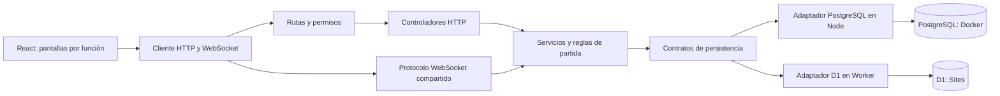

# FlashReto

Para levantar todo con un solo comando y sin instalar Node en la PC, sigue [LEVANTAR.md](LEVANTAR.md): `bash iniciar.sh`.

Aplicación web de flashcards y exámenes de opción múltiple en español. Un **administrador** organiza áreas, temas, preguntas y exámenes; un **usuario** se registra, entra con contraseña y participa en partidas de dos personas mediante un código de seis dígitos. Los navegadores reciben los cambios mediante WebSocket.

Hay dos formas de ejecutarla: **PostgreSQL y Node en Docker** para el entorno local, y **D1 y Cloudflare Workers** para el sitio publicado en Sites. Comparten las mismas pantallas, validaciones, API y reglas de la partida. Sus bases de datos son independientes; los datos del sitio publicado no se copian al contenedor.

## Ejecutar PostgreSQL con Docker

Con Docker Desktop encendido, selecciona el Node 24 que ya tienes en NVM y ejecuta dentro de la carpeta del proyecto:

```bash
nvm use 24.18.1
npm ci
npm run docker:up
```

Abre **http://localhost:3000**. Docker Compose compila la aplicación y levanta dos servicios: `web` (React, API REST de Node y WebSocket) y `db` (PostgreSQL 18). El backend aplica las migraciones de `db/postgres` antes de aceptar solicitudes. Las imágenes están fijadas por digest y las dependencias por `package-lock.json`.

La primera ejecución genera una contraseña aleatoria de base de datos en `.env.docker`, un archivo local ignorado por Git y por el contexto de Docker. Las contraseñas de las cuentas de la aplicación se eligen al registrarse y se guardan derivadas con PBKDF2.

```bash
npm run docker:logs
npm run docker:down
```

`docker:down` detiene y elimina los contenedores, conservando el volumen `postgres-data`. Al volver a ejecutar `docker:up`, permanecen las cuentas, preguntas y salas. PostgreSQL se publica solo en `127.0.0.1`, en el puerto `POSTGRES_PORT` de `.env.docker`, para conectarlo a herramientas como DBeaver: base y usuario `flashreto`, contraseña en ese mismo archivo. Si un puerto está ocupado, cambia `POSTGRES_PORT` o `FLASHRETO_PORT` antes de iniciar.

Para jugar desde otra computadora en tu red, agrega `FLASHRETO_BIND=0.0.0.0` a `.env.docker`, vuelve a ejecutar `docker:up` y abre `http://IP-DE-TU-PC:3000` desde ambos equipos. La base de datos sigue limitada a la conexión local.

También puedes levantar solo `db` con `docker compose --env-file .env.docker up -d db`, configurar `DATABASE_URL`, ejecutar `npm run build:postgres` y después `npm run start:postgres` con Node fuera del contenedor.

## Ejecutar el entorno D1 de Sites

No hace falta instalar otro Node global. Selecciona Node 24 o posterior con tu NVM y, dentro de la carpeta del proyecto, ejecuta:

```bash
nvm use 24
npm ci
npm run build
npm run db:local
npm start
```

Abre `http://127.0.0.1:8787`. `npm run db:local` aplica la migración a la base local y solo debe ejecutarse una vez por base. Para desarrollo con recarga automática, puedes usar `npm run dev` después de preparar la base. La primera cuenta registrada se convierte en **administrador**; todas las demás comienzan como **usuario**. Desde **Usuarios**, un administrador puede cambiar el rol de otra cuenta. No se incluyen contraseñas predefinidas.

## Recorrido

1. Registra la primera cuenta y entra como administrador.
2. Crea un área y un tema en **Mi biblioteca**.
3. Agrega preguntas con cuatro opciones y marca la única respuesta correcta, o impórtalas desde CSV con revisión por fila.
4. Crea un examen con preguntas ordenadas de un solo tema. Puedes estudiar las tarjetas individualmente.
5. En **Partida**, crea una sala y comparte el código. La otra persona crea una cuenta de usuario y entra con ese código desde otro navegador.
6. El anfitrión inicia cada reto. Hay 20 segundos por pregunta y 100 puntos por acierto. El servidor cierra la ronda al responder ambos o agotar el tiempo, revela la solución y calcula la clasificación.

El navegador no recibe la opción correcta mientras la pregunta está abierta. Las respuestas duplicadas y tardías se rechazan en la sala del servidor. Los exámenes toman una copia de sus preguntas al crear la sala, por lo que una edición posterior no altera la partida en curso.

## Arquitectura



```text
frontend/                Pantallas, formularios, estilos y archivos del navegador
  app/                   Página principal y layout de Sites
  src/features/          Autenticación, contenido, estudio, CSV y partida
  src/infrastructure/    Cliente de la API
  components/            Componentes de interfaz reutilizables
  public/                Imágenes e iconos
  main.tsx               Entrada React para Docker
  vite.config.ts         Compilación del frontend para Docker
  vite.sites.config.ts   Configuración del sitio con Vinext
backend/                 API, sesiones, permisos y WebSocket
  src/routes/            Método, URL, permisos y controlador de cada ruta
  src/controllers/       Validación HTTP y respuestas
  src/services/          Casos de uso y reglas de usuarios, contenido y salas
  src/middleware/        Comprobación de sesión y rol
  src/security/          Derivación y comprobación de contraseñas
  src/adapters/          Acceso a PostgreSQL y D1
  sites/                 Entrada Worker y compatibilidad con Sites
  test/                  Integración multijugador y persistencia
db/                      Esquemas y migraciones de base de datos
  postgres/              Migraciones SQL de PostgreSQL
  d1/                    Esquema, configuración y migraciones de SQLite/D1
shared/                  Código que necesitan frontend y backend
  domain/                Modelos, contratos de cuentas y reglas puras
  test/                  Pruebas de contenido, CSV y partida
scripts/                 Instalación, compilación y pruebas del entorno completo
compose.yaml             Servicios Docker y volumen persistente
Dockerfile               Construcción y ejecución de la aplicación
iniciar.sh               Arranque con un solo comando
```

El código del navegador no importa código del servidor. Se comunica con él por HTTP y WebSocket; los tipos públicos de cuentas y las validaciones están en `shared`. El dominio no depende de React ni de SQL. `backend/src/persistence.ts` define los contratos para cuentas, sesiones, bibliotecas y salas; los adaptadores implementan esos contratos con consultas a cada base.

`backend/src/node-server.ts` sirve la API, WebSocket y el frontend compilado. `backend/sites/sites-worker.ts` conecta los mismos casos de uso con el entorno de Sites. Las migraciones se guardan en `db`; las de PostgreSQL tienen un registro y checksum que impiden modificar una migración ya aplicada.

El mapa completo de endpoints está en **`backend/src/routes/api.routes.ts`**. Cada declaración contiene método, URL, acceso (`public`, `authenticated` o `admin`) y controlador. `backend/src/router.ts` encuentra la ruta, verifica la sesión y los permisos, llama al controlador y convierte los errores en respuestas. Los controladores validan los parámetros y el JSON; los servicios reciben datos y contratos de persistencia, sin depender de `Request`, `Response` ni de un controlador SQL.

Por ejemplo, `POST /api/login` entra en `auth.controller.login`, valida las credenciales, llama a `auth.service.loginAccount`, crea la sesión y devuelve la misma cookie que usaba la aplicación. El adaptador PostgreSQL o D1 realiza las consultas. La ruta WebSocket también se declara en ese mapa; cada entorno conserva su propio transporte y usa el mismo servicio de sala para validar jugadores y actualizar la partida.

Se conserva un solo `package.json` y `package-lock.json` en la raíz para instalar y ejecutar todo sin pasos adicionales. La separación es de código y responsabilidades; el entorno sigue usando dos contenedores: la aplicación y PostgreSQL. La compilación local genera `frontend/dist` y `backend/dist`, ambos ignorados por Git. El pequeño `vite.config.ts` de la raíz permite que Sites encuentre la configuración de `frontend`.

La biblioteca de cada administrador se almacena como un documento validado: JSONB en PostgreSQL y texto JSON en D1. Las cuentas y sesiones tienen sus propias tablas y claves foráneas. Esto mantiene pequeñas y comprensibles las operaciones de creación, edición, eliminación e importación. Un número de revisión evita sobrescribir cambios hechos en otra pestaña. El servidor comprueba propiedad, relaciones y respuesta correcta antes de aceptar el documento. Las sesiones usan cookies `HttpOnly` con `SameSite=Lax`; las contraseñas se derivan con PBKDF2 y una sal individual.

Los hashes nuevos incluyen el algoritmo y su número de iteraciones. Node conserva 310.000 iteraciones; Sites utiliza 100.000, el máximo que admite el servidor de Cloudflare. Se mantiene la lectura de las contraseñas antiguas de Node. Las bases son independientes y este cambio no requiere borrar cuentas ni cambiar tablas. La prueba de registro de Sites reproduce el límite de producción, que el Worker local no aplica.

Se eligió **REST** porque las operaciones son directas y no requieren el esquema y los resolutores de GraphQL. **WebSocket** envía las actualizaciones a ambos jugadores. El backend controla el tiempo, las respuestas y la puntuación; cada cambio de sala usa una revisión condicional en la base de datos, de modo que dos respuestas simultáneas no duplican puntos. Cada conexión observa las revisiones. PostgreSQL usa transacciones para elegir un solo primer administrador y para cambiar roles; las consultas usan parámetros. Para muchas salas concurrentes convendría sustituir la observación periódica de revisiones por un sistema de publicación de eventos.

## API principal

| Ruta | Uso |
| --- | --- |
| `POST /api/register`, `POST /api/login`, `POST /api/logout`, `GET /api/me` | Cuentas y sesión |
| `GET/PUT /api/content` | Biblioteca del administrador, con revisión |
| `GET /api/users`, `PATCH /api/users/:id` | Administración de los dos roles |
| `POST /api/rooms` | Crear sala desde un examen |
| `POST /api/rooms/:code/join` | Unirse a una sala |
| `GET /api/rooms/:code/ws` | Conexión WebSocket de la partida |
| `GET /api/health` | Conectividad de la base de datos y existencia de la tabla de salas |

## Pruebas

```bash
npm run typecheck
npm test
npm run build
npm run build:postgres
npm run test:postgres
```

`npm test` verifica las reglas del dominio y los contratos de la API: sesión ausente o vencida, permisos de ambos roles, origen, JSON inválido, rutas y parámetros, acceso WebSocket y compatibilidad de contraseñas y cookies existentes.

`npm run test:postgres` crea un proyecto Docker desechable, con puertos y volumen propios. Ejecuta el recorrido con **dos clientes WebSocket reales**, recrea ambos contenedores conservando el volumen y verifica que la cuenta, la pregunta y la clasificación permanecen. Al terminar elimina solo los recursos de ese proyecto de prueba. No usa la base del entorno normal.

`npm run test:integration` permite ejecutar el mismo recorrido contra un servidor local iniciado con una **base vacía**, usando `FLASHRETO_URL`. Comprueba registros simultáneos con un solo administrador, contraseña incorrecta, correo duplicado, permisos, revisiones, código inválido, pregunta oculta, puntuación, final y cierre por tiempo. Utiliza correos de `example.test` y una contraseña aleatoria solo para esa ejecución. Las pruebas de dominio incluyen CSV válido e inválido, examen vacío y respuesta tardía.

## Alcance

La generación por IA no está implementada. El contenido se introduce manualmente o con CSV (`pregunta,opcion_a,opcion_b,opcion_c,opcion_d,correcta`, donde `correcta` es A, B, C o D). El despliegue de Sites sigue siendo privado y utiliza D1. El PostgreSQL de Docker corre en tu computadora; para usarlo públicamente habría que alojar estos contenedores en un servidor con HTTPS, o proporcionar una API y un PostgreSQL alojados. En local, dos navegadores pueden jugar de inmediato.
