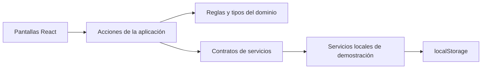

# FlashReto

Prototipo web en español para crear preguntas de opción múltiple, organizarlas por áreas y temas, estudiar con flashcards y recorrer una partida entre dos personas. Las cuentas, las propuestas de IA y la partida están marcadas como **demostración**; el contenido se conserva en el navegador.

## Ejecutar

Requiere Node.js 24 o posterior. En la carpeta `flashreto`:

```bash
npm ci
npm run dev
```

Abre la dirección local que indique el servidor. Para comprobar el proyecto:

```bash
npm run typecheck
npm test
npm run build
```

El prototipo incluye tres usuarios de muestra (Lucía, Mateo y Sofía). El selector de la esquina superior derecha cambia el contenido visible de cada creador. Este selector **no autentica**; sirve para explorar la separación del contenido.

## Recorrido sugerido

1. En **Mi biblioteca**, crea un área y después un tema.
2. En **Preguntas**, elige ese tema y crea una pregunta con cuatro opciones. Marca una respuesta correcta.
3. En **Exámenes**, selecciona las preguntas del tema y ordénalas.
4. En **Estudiar**, gira las tarjetas para revelar la respuesta.
5. En **Partida demo**, crea una sala, introduce el código como invitado, responde alternando las dos vistas y revisa la clasificación.

También puedes descargar la plantilla CSV desde **Importar CSV**, revisar los errores por fila y guardar todas las preguntas válidas. **Asistente IA** ofrece ejemplos preparados para Biología celular, Historia universal y Programación básica, además de alternativas de ejemplo editables para preguntas propias.

## Organización del código



- `src/domain`: tipos y reglas puras. Valida preguntas, propiedad del contenido, composición de exámenes y puntuación.
- `src/features`: pantallas y casos de uso por funcionalidad. La interfaz invoca las reglas del dominio y muestra errores.
- `src/infrastructure`: datos iniciales y contrato de persistencia con implementación local.
- `app`: entrada React, navegación y estilos.
- `test`: pruebas de reglas de contenido, CSV y partida.

El recorrido de guardado es: **formulario → validación del dominio → nuevo estado → repositorio local → interfaz**. Al cargar, el repositorio valida lo almacenado y, si está dañado, usa los datos de ejemplo.

## Contratos y siguiente fase

Los tipos `User`, `Area`, `Topic`, `Question`, `Exam` y `GameSession` describen los datos. `ContentRepository` define la persistencia. La función de actualización de la interfaz acepta una transformación del estado y muestra los errores del dominio sin replicar las reglas en cada formulario.

En una versión con backend, una API gestionará autenticación y contenido en PostgreSQL. Socket.IO enviará eventos de sala, pregunta, respuesta, cierre de ronda y resultados. El servidor controlará el tiempo, ocultará la respuesta correcta hasta cerrar la ronda y calculará los puntos. La generación por IA se ejecutará en el servidor, con revisión del contenido antes de guardarlo.

### CSV

Encabezados obligatorios: `pregunta,opcion_a,opcion_b,opcion_c,opcion_d,correcta`. La columna `correcta` contiene A, B, C o D. Se admiten comillas para texto con comas. La importación se bloquea si cualquier fila tiene un error.

### Limitaciones del prototipo

Los datos se guardan solo en el navegador actual. El código de sala sirve para probar el flujo dentro de la misma página; no sincroniza dos dispositivos. La IA usa ejemplos preparados y no genera contenido a partir de una API.
