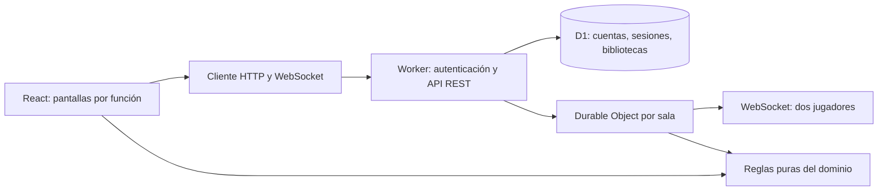

# FlashReto

Aplicación web de flashcards y exámenes de opción múltiple en español. Un **administrador** organiza áreas, temas, preguntas y exámenes; un **usuario** se registra, entra con contraseña y participa en partidas de dos personas mediante un código de seis dígitos. Las preguntas se guardan en D1 y las salas se sincronizan con WebSocket.

## Ejecutar con NVM

No hace falta instalar otro Node global. Selecciona Node 24 o posterior con tu NVM y, dentro de `flashreto`, ejecuta:

```bash
nvm use 24
npm ci
npm run build
npm run db:local
npm start
```

Abre `http://127.0.0.1:8787`. `npm run db:local` aplica la migración a la base local y solo debe ejecutarse una vez por base. Para desarrollo con recarga automática, puedes usar `npm run dev` después de preparar la base. La primera cuenta registrada se convierte en **administrador**; todas las demás comienzan como **usuario**. Desde **Usuarios**, un administrador puede cambiar el rol de otra cuenta. No se incluyen contraseñas predefinidas.

## Recorrido

1. Registra la primera cuenta y entra como administrador.
2. Crea un área y un tema en **Mi biblioteca**.
3. Agrega preguntas con cuatro opciones y marca la única respuesta correcta, o impórtalas desde CSV con revisión por fila.
4. Crea un examen con preguntas ordenadas de un solo tema. Puedes estudiar las tarjetas individualmente.
5. En **Partida**, crea una sala y comparte el código. La otra persona crea una cuenta de usuario y entra con ese código desde otro navegador.
6. El anfitrión inicia cada reto. Hay 20 segundos por pregunta y 100 puntos por acierto. El servidor cierra la ronda al responder ambos o agotar el tiempo, revela la solución y calcula la clasificación.

El navegador no recibe la opción correcta mientras la pregunta está abierta. Las respuestas duplicadas y tardías se rechazan en la sala del servidor. Los exámenes toman una copia de sus preguntas al crear la sala, por lo que una edición posterior no altera la partida en curso.

## Arquitectura



- `src/domain`: modelos, validación de contenido y transiciones puras de la partida; no depende de React ni de D1.
- `src/features`: formularios y pantallas de autenticación, biblioteca, preguntas, exámenes, estudio, CSV y partida.
- `src/infrastructure/api-client.ts`: único punto de acceso HTTP desde React.
- `src/server`: router REST, autenticación, validación de contenido y Durable Object que controla la sala.
- `db/schema.ts` y `drizzle/`: esquema y migración de SQLite/D1.
- `build/sites-worker.ts`: entrada del Worker; deriva `/api/*` al router y el resto a Vinext.

La biblioteca de cada administrador se almacena como un documento JSON validado en D1. Esto mantiene pequeñas y comprensibles las operaciones de creación, edición, eliminación e importación. Un número de revisión evita sobrescribir cambios hechos en otra pestaña. El servidor comprueba propiedad, relaciones y respuesta correcta antes de aceptar el documento. Las sesiones usan cookies `HttpOnly` con `SameSite=Lax`; las contraseñas se derivan con PBKDF2 y una sal individual.

Se eligió **REST** porque las operaciones son directas y no requieren el esquema y los resolutores de GraphQL. **WebSocket** sí aporta valor aquí: la sala envía los cambios de ronda y puntuación a ambos jugadores sin sondeo. Cada sala tiene una única autoridad para tiempo, respuestas y puntuación.

## API principal

| Ruta | Uso |
| --- | --- |
| `POST /api/register`, `POST /api/login`, `POST /api/logout`, `GET /api/me` | Cuentas y sesión |
| `GET/PUT /api/content` | Biblioteca del administrador, con revisión |
| `GET /api/users`, `PATCH /api/users/:id` | Administración de los dos roles |
| `POST /api/rooms` | Crear sala desde un examen |
| `POST /api/rooms/:code/join` | Unirse a una sala |
| `GET /api/rooms/:code/ws` | Conexión WebSocket de la partida |
| `GET /api/health` | Estado de las vinculaciones de D1 y salas |

## Pruebas

```bash
npm run typecheck
npm test
npm run build
```

`npm run test:integration` ejecuta un recorrido con **dos clientes WebSocket reales** contra un servidor local iniciado con una **base vacía**. Comprueba el primer administrador, el rol usuario, permisos, persistencia, código inválido, pregunta oculta, puntuación, final y nuevo inicio de sesión. Utiliza correos de `example.test` y una contraseña aleatoria solo para esa ejecución. Si quieres repetir la prueba, prepara otra base local vacía y apunta `FLASHRETO_URL` al servidor correspondiente. Las pruebas de dominio incluyen examen vacío y respuesta tardía.

## Alcance

La generación por IA no está implementada. El contenido se introduce manualmente o con CSV (`pregunta,opcion_a,opcion_b,opcion_c,opcion_d,correcta`, donde `correcta` es A, B, C o D). El despliegue de Sites sigue siendo privado para su propietario; para que otra persona visite esa URL es necesario darle acceso en Sites o cambiar explícitamente el público del sitio. En local, dos navegadores pueden jugar de inmediato.
